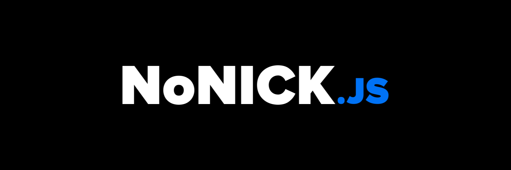



# NoNICK.js
Discordサーバーの運営をサポートする多機能BOTです。  
「基本無料・オープンソース」の理念のもと、開発を続けています。

## 🔗リンク
* サポートサーバー: https://discord.gg/q4FcBm2P42
* Webダッシュボード: https://dashboard.nonick-js.com
* ロードマップ: https://github.com/users/nonick-mc/projects/2

## 📑開発方法
### Discordアプリケーションを作成する
まず、[Discord開発者ポータル](https://discord.com/developers/applications)で開発用のDiscordアプリケーションを作成する必要があります。アプリケーションを作成したら、「OAuth2」タブにアクセスし、`Redirects`に以下のURLを追加してください。

* `http://localhost:3000/api/auth/callback/discord`
* `http://localhost:3000`

### 環境変数を設定する
以下のディレクトリにある`.env.sample`を基に、それぞれの`.env.sample`と同じディレクトリに環境変数ファイルを作成してください。

* `apps/bot` ... `.env`を作成
* `apps/dashboard` ... `.env.local`を作成
* `packages/bot` ... `.env`を作成

### 開発コマンドを実行する
設定が終わったら、以下のコマンドを使用して開発サーバーを起動します。

```sh
pnpm dev
```
